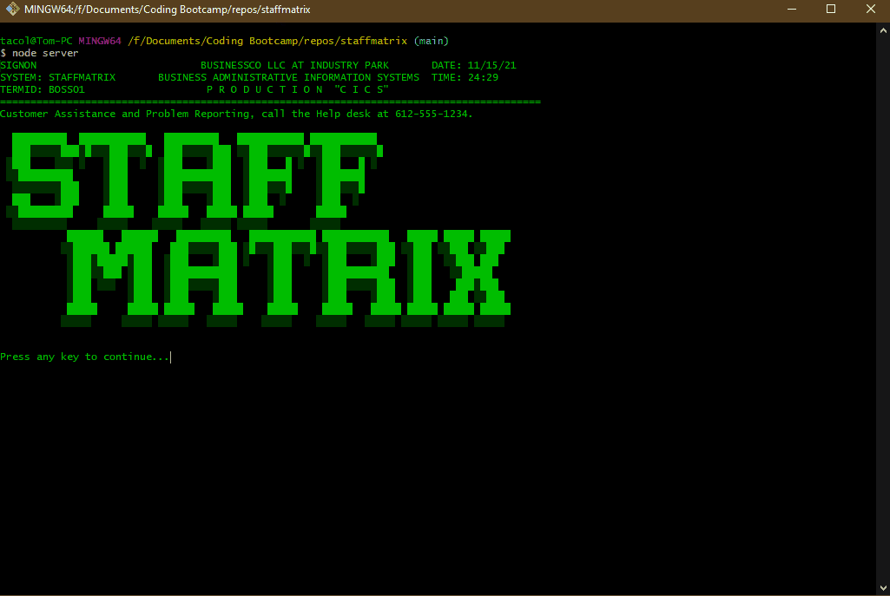

# StaffMatrix
## Badges

## Table of Contents
  - [Badges](#badges)
  - [License](#license)
  - [Description](#description)
  - [Usage](#usage)
  - [Contributing](#contributing)
  - [Questions](#questions)
  - [Screenshots](#screenshots)

## License
Read more about GPL Version 2 here:
[GPL Version 2](https://www.gnu.org/licenses/old-licenses/gpl-2.0.en.html)

## Description
StaffMatrix is a Content Management System for staffing.  The look of StaffMatrix was inspired by previous usage of the IBM CICS environment for mainframe access - hopefully, you can tell!

StaffMatrix hosts a variety of features for a whole suite of staff management, with a cheeky interface.

## Usage
To use this application, you must have:
1) MySQL 
2) Node.js

Once you have cloned the repo, you must follow these additional steps:
1) navigate to the db folder
2) copy example.settings.js
3) rename example.settings.js to settings.js
4) update the username and password

Without following these steps, the application will not function.  

## Contributing
This project utilizes the [Contributor Covenant](https://www.contributor-covenant.org/version/2/1/code_of_conduct/).

## Questions
If you have any questions on this project:
* please [open an issue](https://github.com/Caeldeth/staffmatrix/issues)
* or contact me via [email](mailto:tacolejr@gmail.com?subject=[Github%20Question%20-%20staffmatrix]).

Visit my [profile](https://github.com/Caeldeth) to see more great projects!
  
## Screenshots
Click the image or [here](https://watch.screencastify.com/v/U5o66a08VC5ezzX8cApp) to see the video walkthrough

